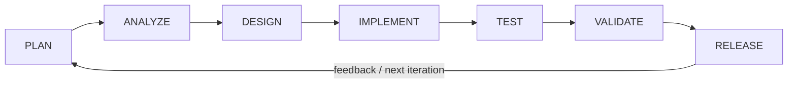
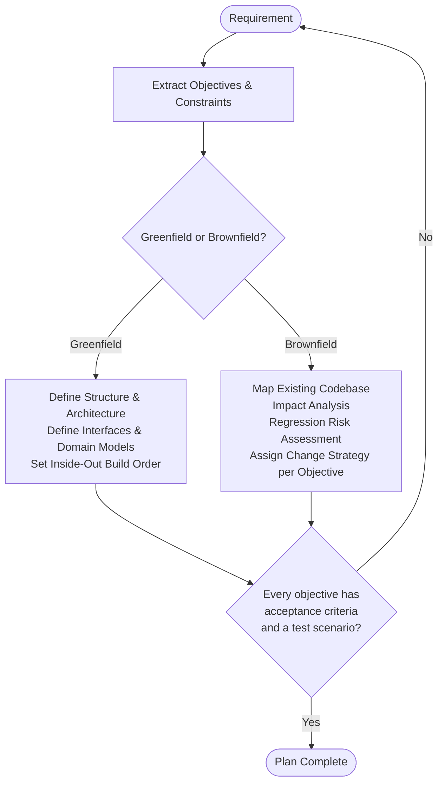
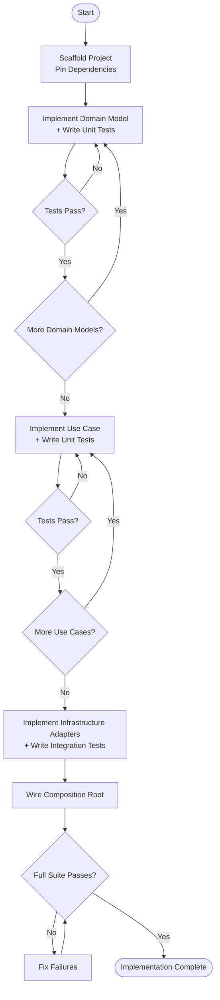
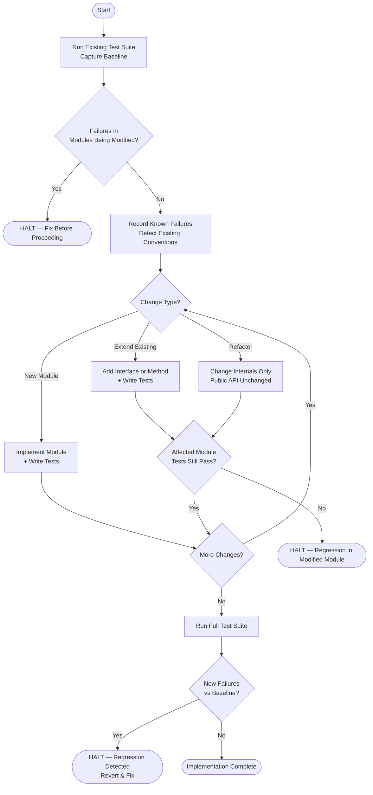
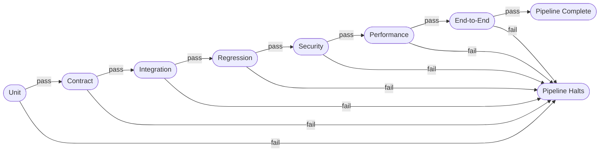
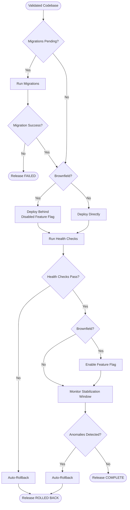
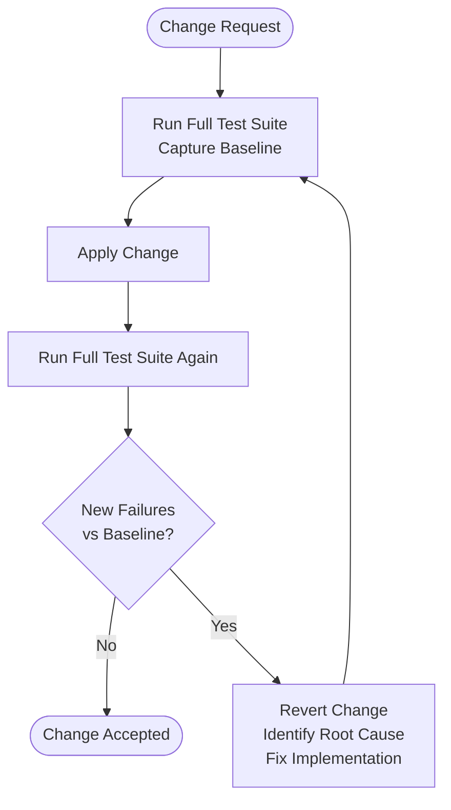

# Software Development Lifecycle Specification

This document is a language-agnostic specification for a complete, autonomous software development lifecycle. It defines how software is planned, designed, implemented, tested, validated, and released — whether building a new application from scratch or modifying an existing codebase.

It is designed for AI-driven development pipelines and software factories, including [Attractor](https://github.com/strongdm/attractor). All code produced under this lifecycle must conform to the companion [Universal Code Specification](./UNIVERSAL_CODE_SPECIFICATION.md).

The core guarantee: new features do not break existing behavior.

---

## Table of Contents

1. [Pipeline Overview](#1-pipeline-overview)
2. [Greenfield vs. Brownfield](#2-greenfield-vs-brownfield)
3. [Phase 1: Planning and Requirements](#3-phase-1-planning-and-requirements)
4. [Phase 2: Design and Interface Contracts](#4-phase-2-design-and-interface-contracts)
5. [Phase 3: Implementation](#5-phase-3-implementation)
6. [Phase 4: Testing Strategy](#6-phase-4-testing-strategy)
7. [Phase 5: Validation and Quality Gates](#7-phase-5-validation-and-quality-gates)
8. [Phase 6: Release and Deployment](#8-phase-6-release-and-deployment)
9. [Regression Prevention Protocol](#9-regression-prevention-protocol)
10. [AI Agent SDLC Contract](#10-ai-agent-sdlc-contract)
11. [Definition of Done](#11-definition-of-done)

---

## 1. Pipeline Overview

Every change — feature, fix, or refactor — follows this loop. Each phase has entry criteria (what must be true before starting) and exit criteria (what must be true before advancing). The pipeline halts on any unmet exit criterion.

---

## 2. Greenfield vs. Brownfield

Every phase in this specification branches on two scenarios. The agent detects which applies before proceeding.

### 2.1 Greenfield (New Application)

A greenfield project has no existing codebase. The project directory is empty or contains only scaffolding. No source files, tests, or dependency manifests exist. The requirements describe a new system with no prior version.

The agent starts from zero and defines all structure, architecture, and interfaces before writing any implementation code.

### 2.2 Brownfield (Existing Application)

A brownfield project has an existing codebase. Source files and tests are present. Dependency manifests declare packages. Git history or prior documentation exists.

The agent reads and understands the existing system before proposing or making any changes. When in doubt, treat a project as brownfield. It is always safer to analyze first than to overwrite.

---

## 3. Phase 1: Planning and Requirements

### 3.1 Purpose

Translate a high-level request into a structured, unambiguous plan that an autonomous agent can execute without further human input.

### 3.2 Entry Criteria

A requirement or task description exists — an issue, ticket, prompt, or NLSpec.

### 3.3 Process

The agent parses the requirement into discrete, testable objectives. Each objective must have a concrete outcome that can be verified. Vague goals are broken down until every piece is independently verifiable. Constraints are identified: target language, framework limitations, performance requirements, security concerns, and any non-functional considerations stated or implied.

### 3.4 Greenfield Planning

For a greenfield project, the agent defines the folder structure and layered architecture before any implementation begins. Public interfaces and domain models are defined upfront. A build order is established that sequences work from the inside out: domain models first, then application logic, then infrastructure adapters, then the interface layer. A test plan is generated covering all objectives.

### 3.5 Brownfield Planning

For a brownfield project, the agent maps the existing architecture: public interfaces, test suite coverage, naming conventions, file structure patterns, and coding style. Understanding the existing system is a prerequisite to changing it.

An impact analysis identifies which existing modules each objective touches. A regression risk assessment identifies which existing tests could be affected. A change strategy is assigned to each objective: if the objective touches an existing interface, the strategy is to extend with backwards compatibility; if it introduces net-new functionality, the strategy is to add a new module.

### 3.6 Exit Criteria

- Every objective has clear acceptance criteria.
- Every objective has at least one test scenario.
- Greenfield: folder structure and architecture are defined.
- Brownfield: impact analysis and regression risk are assessed.
- No ambiguous requirements remain. All assumptions are stated explicitly.

---

## 4. Phase 2: Design and Interface Contracts

### 4.1 Purpose

Define the public interfaces, data contracts, and module boundaries before writing implementation code. This is the single most important phase for preventing breaking changes.

### 4.2 Rules

1. **Interface-first.** Each module's public API is defined before coding internals.
2. **Contract-driven.** Every interface has a contract: inputs, outputs, invariants, and error cases.
3. **Additive changes only (brownfield).** New behavior is added through new interfaces or optional extensions to existing ones. Existing signatures are never modified.
4. **Domain models are immutable value objects** where possible.

### 4.3 Process

For each module in the plan, the agent defines its public interface: name, available operations, input types, output types, and all error cases. Then it defines the contract for that interface — the testable assertions about its behavior, including invariants and edge cases. Interfaces and contracts are completed for all modules before implementation begins on any of them.

### 4.4 Brownfield: Non-Breaking Interface Extension

When a brownfield change requires new behavior on an existing interface, the existing interface is left untouched. A new interface or method is added alongside it. Consumers of the original interface are unaffected. Consumers that need the new behavior adopt the new interface explicitly.

Changing an existing method signature is a breaking change and is never done in a single release. If a signature must change, the old version is deprecated first, the new version is introduced in parallel, consumers are migrated, and the old version is removed only after all consumers have moved.

### 4.5 Exit Criteria

- Every module has a defined interface with inputs, outputs, and error cases.
- Every interface has a testable contract.
- Brownfield: no existing interface signatures are modified.
- Data models are defined with validation rules.

---

## 5. Phase 3: Implementation

### 5.1 Purpose

Write production code that satisfies the design contracts. All code conforms to the [Universal Code Specification](./UNIVERSAL_CODE_SPECIFICATION.md).

### 5.2 Implementation Order

The system is built from the inside out — stable core first, volatile edges last:

1. Domain models and value objects
2. Domain logic (pure functions, no I/O)
3. Application services and use cases
4. Interface adapters (repositories, API clients)
5. Infrastructure wiring (dependency injection, config loading)
6. Interface layer (HTTP handlers, CLI commands, UI)

Each layer is tested before the next layer is started. No layer depends on a layer above it.

### 5.3 Greenfield Implementation

The project structure is scaffolded and a dependency manifest is created with all versions pinned. Each layer is implemented and tested in order before the next begins. Tests for each unit must pass before moving on.

### 5.4 Brownfield Implementation

Before writing any code, the full existing test suite runs to establish a baseline. If there are pre-existing failures in modules that the change will touch, the pipeline halts. Pre-existing failures in unrelated modules are recorded but do not block the change.

All new code matches the existing conventions of the project exactly. Changes follow the extend-not-modify strategy throughout.

### 5.5 Exit Criteria

- All design contracts are implemented.
- Tests are written alongside implementation, not after.
- Greenfield: full test suite passes.
- Brownfield: zero new test failures compared to baseline.
- Code conforms to the [Universal Code Specification](./UNIVERSAL_CODE_SPECIFICATION.md).

---

## 6. Phase 4: Testing Strategy

### 6.1 Purpose

Verify correctness, prevent regressions, and ensure robustness through layered, automated testing. Tests are the primary mechanism for guaranteeing that new features do not break existing behavior.

### 6.2 Test Layers

| Layer       | Scope                  | Speed  | Quantity        |
| ----------- | ---------------------- | ------ | --------------- |
| Unit        | Single function/class  | Fast   | Many            |
| Integration | Module boundaries      | Medium | Moderate        |
| Contract    | Interface agreements   | Fast   | Per interface   |
| Regression  | Previously broken code | Fast   | Grows over time |
| End-to-End  | Full user journey      | Slow   | Few             |
| Performance | Latency / throughput   | Varies | Critical paths  |
| Security    | Vulnerabilities        | Medium | Attack surfaces |

### 6.3 Unit Tests

Unit tests cover isolated logic with no I/O, no network, and no filesystem. One behavior is tested per test. Tests follow Arrange-Act-Assert structure. All external dependencies are injected — clocks, randomness, and collaborators are never called directly. The same input always produces the same output. The full unit suite runs in seconds.

### 6.4 Integration Tests

Integration tests verify that module boundaries work together correctly. Real dependencies are used — a test database, a test file system — not mocks. Each test starts with a clean state. The adapter is what is tested, not the business logic behind it.

### 6.5 Contract Tests

Contract tests verify that every implementation of an interface satisfies the interface's declared contract. One contract test suite exists per interface. That suite runs against every implementation — both existing and new. If a new implementation fails a contract test, the implementation is wrong, not the test.

### 6.6 Regression Tests

A regression test is created for every bug fix and for every previously broken behavior. The test must fail before the fix is applied and pass after. Regression tests are tagged with an identifier (such as a ticket or bug number) for traceability. The regression suite grows monotonically — tests are never removed.

### 6.7 End-to-End Tests

End-to-end tests cover complete user journeys through the full stack. Only the most critical user flows are covered. These tests are slow and tolerate some brittleness. They run in a production-like environment. The maximum number of E2E tests per application is 10-20.

### 6.8 Performance Tests

Performance tests measure critical paths against defined latency and throughput budgets. Budgets are defined before the tests are written. Tests run under realistic load — not against empty databases or idle systems. The pipeline fails if any budget is exceeded.

### 6.9 Security Tests

Security tests verify that the application resists common attack vectors. Input validation boundaries are tested for SQL injection, XSS, and path traversal. Authentication and authorization are verified to be enforced on all protected endpoints. Secrets, tokens, and stack traces are verified not to appear in logs, error responses, or API output. Dependency vulnerability scans are run on every build.

### 6.10 Test Execution Order

Tests run in this sequence. The pipeline halts immediately on any failure — later stages do not run if earlier stages fail.

---

## 7. Phase 5: Validation and Quality Gates

### 7.1 Purpose

Automated checks that pass before any change is accepted. In a dark factory, the gates are absolute. There is no human override.

### 7.2 Quality Gates

**Gate 1 — Code Standards**
Code conforms to the Universal Code Specification. The linter passes with zero warnings. No function exceeds 30 lines. No file exceeds 300 lines. No circular dependencies exist.

**Gate 2 — Test Coverage**
Unit test coverage is at least 80% of business logic. Every public interface has contract tests. Every bug fix has a regression test. Zero tests are skipped or ignored without a documented reason.

**Gate 3 — Regression**
The full test suite passes. Brownfield: zero new failures compared to the recorded baseline. All previously passing tests still pass.

**Gate 4 — Security**
No hardcoded secrets exist in the codebase. No vulnerable dependencies are present (CVE scan passes). Input validation is applied on all external boundaries. All database queries are parameterized.

**Gate 5 — Performance**
No performance regression exists on critical paths. Latency budgets are met under the defined load profile.

**Gate 6 — Backwards Compatibility (brownfield only)**
No public interface signatures are changed. No public methods are removed or renamed. API versioning is applied for any behavioral changes. Existing consumers are unaffected.

### 7.3 Gate Enforcement

Each gate is evaluated in sequence. If any gate fails, its name and specific failing conditions are logged and the pipeline is rejected immediately. No gate is skipped. The pipeline does not proceed to release until all gates pass.

---

## 8. Phase 6: Release and Deployment

### 8.1 Purpose

Ship validated code safely with rollback capability.

### 8.2 Rules

1. Code that has not passed all quality gates is never deployed.
2. New behavior in brownfield applications ships behind feature flags, disabled by default, and enabled after post-deploy verification.
3. Deployments are atomic. A release either fully succeeds or fully rolls back.
4. A rollback plan exists for every deployment. Post-deploy health check failures trigger automatic rollback.
5. Database migrations are forward-only and backwards-compatible. Destructive operations (DROP, RENAME) are never bundled in the same release as the code that depends on them.

### 8.3 Deployment Sequence

### 8.4 Database Migration Safety

Database schema changes and the application code that depends on them are never deployed in the same release. A column rename, for example, requires three separate releases: the first adds the new column and backfills data from the old one while code reads from both; the second migrates all code to read only from the new column while the old column remains; the third drops the old column once all consumers have moved.

---

## 9. Regression Prevention Protocol

This is the core guarantee of the dark factory: new features do not break existing behavior.

### 9.1 Rules

1. **Baseline before change.** The full test suite runs before modifying anything. The result is recorded as the baseline.
2. **Tests alongside code.** Every new function, module, or endpoint ships with tests. Code without tests is not considered implemented.
3. **Contract lock.** Once a public interface is released, its contract tests are immutable. New implementations must pass all existing contract tests.
4. **Additive-only changes.** In brownfield, behavior is extended through new interfaces or optional parameters. Existing signatures are never modified.
5. **Regression test on every bug fix.** A bug without a regression test will recur.
6. **Snapshot comparison.** For complex outputs such as API responses and serialized data, stored snapshots detect unintended changes.
7. **Dependency pinning.** All dependency versions are pinned. Dependencies are upgraded in isolated, independently tested changes — never bundled with feature work.

### 9.2 Prevention Workflow

---

## 10. AI Agent SDLC Contract

When operating autonomously in a dark factory pipeline, the AI agent adheres to the following contract.

### Planning

1. Detects greenfield vs. brownfield before any other action.
2. Analyzes the full existing codebase (brownfield) before proposing changes.
3. States all assumptions explicitly. Unstated requirements are never assumed.
4. Breaks work into small, independently testable increments.
5. Defines acceptance criteria and at least one test scenario for every objective.

### Implementation

6. Follows the implementation order: domain → application → infrastructure → interface.
7. Writes tests before or alongside implementation, never after.
8. Conforms to existing conventions in brownfield projects. Naming, structure, and patterns are matched exactly.
9. Uses extend-not-modify for all brownfield interface changes.
10. Never introduces a dependency without justification. All versions are pinned.

### Testing

11. Runs the full existing test suite before and after every change in brownfield projects.
12. Writes contract tests for every public interface.
13. Writes regression tests for every bug fix.
14. Achieves unit test coverage of at least 80% on new business logic.
15. Never skips, disables, or deletes existing tests.

### Validation

16. Passes all quality gates before considering work complete.
17. Produces zero new test failures compared to the baseline.
18. Introduces no hardcoded secrets and no vulnerable dependencies.
19. Meets performance budgets on all critical paths.

### Release

20. Uses feature flags for new behavior in brownfield applications.
21. Ensures all database migrations are backwards-compatible and separated from dependent code changes.
22. Provides a rollback plan for every deployment.

---

## 11. Definition of Done

A feature or change is complete when:

- [ ] Requirements are unambiguous with stated assumptions.
- [ ] Impact analysis is complete (brownfield).
- [ ] Interfaces are designed with contracts before implementation.
- [ ] Implementation follows inside-out build order.
- [ ] Code conforms to the [Universal Code Specification](./UNIVERSAL_CODE_SPECIFICATION.md).
- [ ] Unit tests cover at least 80% of new business logic.
- [ ] Contract tests exist for every public interface.
- [ ] Integration tests verify all boundary adapters.
- [ ] Regression tests exist for every bug fix.
- [ ] Full test suite passes with zero new failures.
- [ ] All quality gates pass.
- [ ] No public interface signatures are broken (brownfield).
- [ ] Feature flags are in place for new behavior (brownfield).
- [ ] Deployment is reversible with a rollback plan.
- [ ] Monitoring and health checks are configured.
